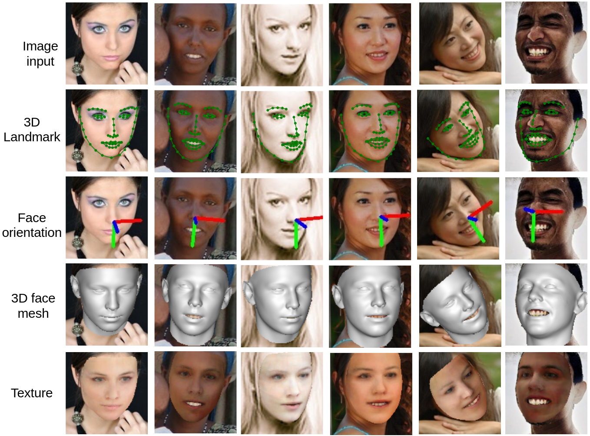
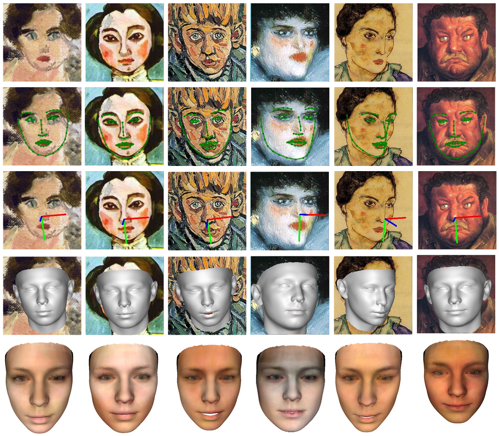
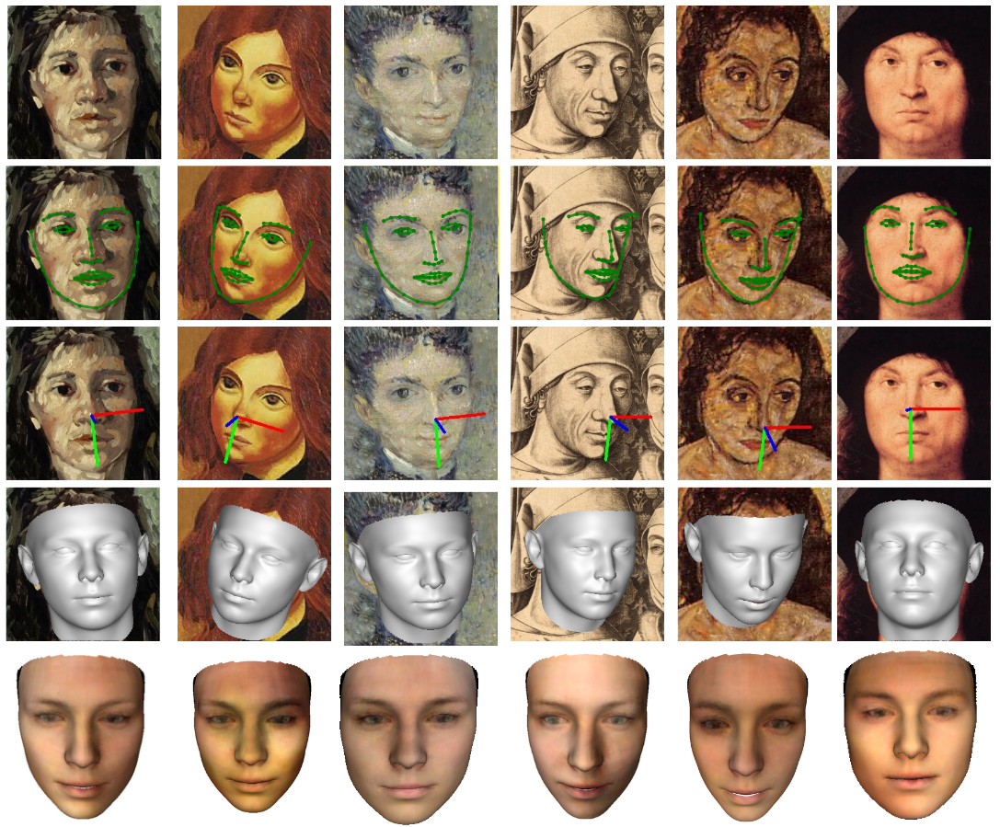

# M3-LRN
Arxiv 2021: Accurate 3D Facial Geometry Prediction by Multi-Task, Multi-Modal, andMulti-Representation Landmark Refinement Network

Cho-Ying Wu, Qiangeng Xu, Ulrich Neumann, CGIT Lab at University of Souther California

**Advantages:**

\+ **State-of-the-art on all 3D facial alignment, face orientation estimation, and 3D face modeling.**

\+ **Exploitation of Multi-Modal and Multi-Representation for information aggregation.**

\+ **Fast and easy to use: 3000fps for 3D facial landmarks  on a RTX2080 GPU.**

\+ ** The first to study the face reconstrcutability from sparse landmarks.**

More results:

Codes will be ready soon.
