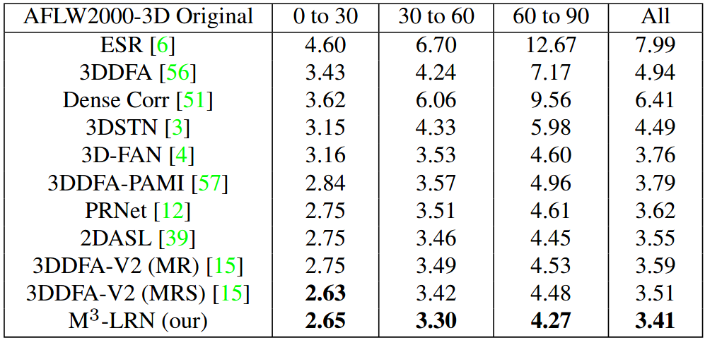
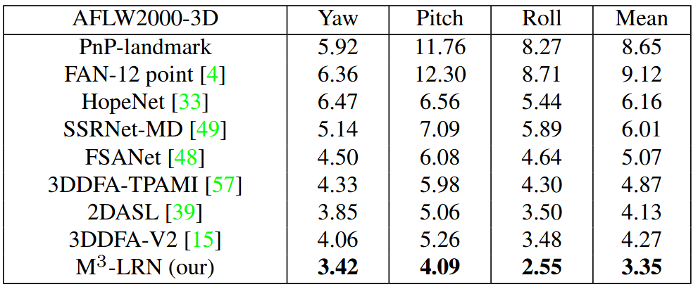

# M3-LRN
Arxiv 2021: Accurate 3D Facial Geometry Prediction by Multi-Task, Multi-Modal, and Multi-Representation Landmark Refinement Network

Cho-Ying Wu, Qiangeng Xu, Ulrich Neumann, CGIT Lab at University of Souther California

[<a href="https://arxiv.org/pdf/2104.08403.pdf">paper</a>] [<a href="https://choyingw.github.io/works/M3-LRN/index.html">project page</a>]

**Advantages:**

\+ **State-of-the-art on all 3D facial alignment, face orientation estimation, and 3D face modeling.**

\+ **Exploitation of Multi-Modal and Multi-Representation for information aggregation.**

\+ **Fast and easy to use: 3000fps for 3D facial landmarks on a single GPU.**

\+ **The first to study the face reconstrcutability from sparse landmarks.**

More results:

Facial alignemnt on AFLW2000-3D (NME of facial landmarks):

Face orientation estimation on AFLW2000-3D (MAE of Euler angles):

General results: 

**Updates:**
The codes are now released https://github.com/choyingw/SynergyNet. This repo will be archived due to its older version.
